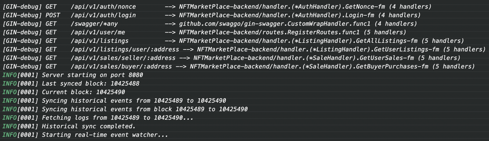

# Readme

## 一、项目说明

本项目同步历史遗迹监控链上合约事件，将事件内容存储在数据库中，并且提供API给前端查询。

## 二、技术栈

- Go v1.25.0 
- Gin v1.12.0
- Gorm v1.31.1
- Mysql 8.0
- Redis 7.0
- Docker 
- JWT
- Swagger

## 三、项目结构

```
NFTMarketPlace-backend/
├── auth/              # JWT 认证与签名验证
├── cache/             # Redis 缓存层
├── config/            # 配置文件加载
├── eth/               # Ethereum 客户端与事件解析
├── handler/           # HTTP 请求处理器
├── listener/          # 区块链事件监听器
├── middleware/        # Gin 中间件
├── models/            # 数据模型
├── repository/        # 数据库访问层
├── routes/            # 路由配置
├── utils/             # 工具函数
└── main.go            # 入口文件
```

## 四、环境搭建

### 1. 配置文件

在 config 文件夹下创建 config.yaml 文件，并按照下面格式填写内容。

``` yaml
# 项目端口
server:
  port: 8080

# 数据库配置
database:
  dsn: "user:password@tcp(ip:port)/database_name?charset=utf8mb4&parseTime=True&loc=Local"

redis:
  addr: "ip:port"
  password: ""
  db: 0

jwt:
  algorithm: "ES256"          # 可选: "HS256", "RS256", "ES256"
  secret: ""                  # 仅 HS256 使用（留空或设为强随机字符串）
  private_key_path: "keys/ec_private.pem"   # 非对称私钥路径
  public_key_path: "keys/ec_public.pem"     # 非对称公钥路径
  expire_hours: 1

eth:
  rpc_url: ""           # Infura/Alchemy 上注册获得
  websocket_url: ""     # Infura/Alchemy 上注册获得
  contract_address: ""  # 部署后的合约地址
  start_block:          # 初始同步区块（可设为部署区块）
```

### 2. MySql & Redis 搭建

项目采用 docker-compose 方式运行 MySql 和 Redis，docker-compose 文件格式如下，按照自己的具体情况完善内容。
``` yaml
version: '3.8'

services:
  # MySQL 服务
  mysql:
    image: mysql:8.0
    restart: unless-stopped
    environment:
      MYSQL_ROOT_PASSWORD: root_pwd
      MYSQL_DATABASE: database_name
      MYSQL_USER: mysql_user
      MYSQL_PASSWORD: mysql_pwd
    ports:
      - port:3306
    volumes:
      - mysql_data:/var/lib/mysql
    networks:
      - local

  # Redis 服务
  redis:
    image: redis:7-alpine
    restart: unless-stopped
    ports:
      - port:6379
    volumes:
      - redis_data:/data
      - ./redis/redis.conf:/usr/local/etc/redis/redis.conf
    networks:
      - local

networks:
  local:
    driver: bridge

volumes:
  mysql_data:
  redis_data:
```
docker 启动命令
``` bash
docker-compose up -d
```

### MySql 脚本

``` sql
create table listed_nfts
(
    id          bigint auto_increment
        primary key,
    list_id     char(66)                                                                 not null,
    nft_address varchar(42)                                                              not null,
    token_id    varchar(78)                                                              not null,
    price       decimal(38)                                                              not null,
    listed_time bigint                                                                   not null,
    seller      varchar(42)                                                              not null,
    expired_at  bigint                                                                   not null,
    status      enum ('listed', 'sold', 'canceled', 'expired') default 'listed'          null,
    created_at  timestamp                                      default CURRENT_TIMESTAMP null,
    updated_at  timestamp                                      default CURRENT_TIMESTAMP null on update CURRENT_TIMESTAMP,
    constraint list_id
        unique (list_id)
);

create index idx_expired
    on listed_nfts (expired_at);

create index idx_nft
    on listed_nfts (nft_address, token_id);

create index idx_seller
    on listed_nfts (seller);

create index idx_status
    on listed_nfts (status);

create table nft_sales
(
    id          bigint auto_increment
        primary key,
    list_id     char(66)                            not null,
    nft_address varchar(42)                         not null,
    token_id    varchar(78)                         not null,
    price       decimal(38)                         not null,
    sold_time   bigint                              not null,
    seller      varchar(42)                         not null,
    buyer       varchar(42)                         not null,
    created_at  timestamp default CURRENT_TIMESTAMP null
);

create table sync_state
(
    id                   int       default 1                 not null
        primary key,
    last_processed_block bigint    default 0                 not null,
    updated_at           timestamp default CURRENT_TIMESTAMP null on update CURRENT_TIMESTAMP
);
```
### 3. 创建 JWT 非对称加密文件

``` bash
# 项目根目录下创建密钥目录
mkdir -p keys

# 生成私钥（PEM 格式）
openssl ecparam -name prime256v1 -genkey -noout -out keys/ec_private.pem

# 从私钥导出公钥
openssl ec -in keys/ec_private.pem -pubout -out keys/ec_public.pem

# 设置权限
chmod 600 keys/ec_private.pem
chmod 644 keys/ec_public.pem
```

## 五、本地运行

### 1. 启动服务
``` bash
go run main.go
```
运行成功后，截图如下：

### 2. Swap API
Swagger 文档地址：http://localhost:8080/swagger/index.html

### 3. JWT 认证 (auth/)

``` go
// 基于钱包签名的登录流程
1. GET /api/v1/auth/nonce?address=0x...  // 获取随机 nonce
2. 使用钱包签名 nonce
3. POST /api/v1/auth/login              // 验证签名获取 JWT
```

**加密算法：** ES256（椭圆曲线数字签名）

### 4. API 接口

| 方法 | 路径 | 说明 | 认证 |
|------|------|------|------|
| GET | `/api/v1/auth/nonce` | 获取登录 nonce | ❌ |
| POST | `/api/v1/auth/login` | 钱包签名登录 | ❌ |
| GET | `/api/v1/user/me` | 当前用户信息 | ✅ |
| GET | `/api/v1/listings` | 所有上架列表 | ✅ |
| GET | `/api/v1/listings/user/:address` | 用户上架列表 | ✅ |
| GET | `/api/v1/sales/seller/:address` | 用户销售记录 | ✅ |
| GET | `/api/v1/sales/buyer/:address` | 用户购买记录 | ✅ |

---