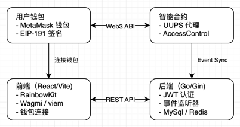

# NFT MarketPlace - 去中心化 NFT 交易平台

一个完整的、生产级别的 NFT 交易市场解决方案，包含智能合约、后端服务和前端应用。

## 目录

- [一、项目简介](#项目简介)
- [二、系统架构](#系统架构)
- [三、核心功能](#核心功能)
- [四、技术栈](#技术栈)
- [五、环境要求](#环境要求)
- [六、说明](#说明)
---

## 一、项目简介

NFT MarketPlace 是一个基于以太坊的去中心化 NFT 交易平台，允许用户安全地上架、购买和交易 ERC-721 NFT。项目采用 UUPS 代理模式实现合约可升级性，并通过基于角色的访问控制（RBAC）确保系统安全性。

### 主要特点

- 基于 OpenZeppelin 的可升级合约，经过审计的安全模式
- 区块链事件监听与数据库实时同步
- 支持钱包连接并基于钱包签名的 API 身份验证
- 可配置的交易手续费机制
- 自动化的上架过期管理

---

## 二、系统架构

---

## 三、核心功能

### 用户功能

1. **钱包连接与认证**
    - 支持主流 Web3 钱包（MetaMask、WalletConnect 等）
    - 基于 EIP-191 的签名验证
    - JWT Token 自动刷新

2. **NFT 上架**
    - 一键授权并上架 ERC-721 NFT
    - 自定义售价（ETH 计价）
    - 自动设置 30 天有效期

3. **购买 NFT**
    - 实时查询上架信息
    - 精确 ETH 支付
    - 自动手续费扣除

4. **取消上架**
    - 卖家随时取消有效上架
    - NFT 自动退回原账户

### 运营管理

1. **角色权限管理**
    - `DEFAULT_ADMIN_ROLE`：超级管理员
    - `PAUSER_ROLE`：暂停/恢复交易
    - `UPGRADER_ROLE`：合约升级
    - `LOGIC_ROLE`：参数配置与清理

2. **批量清理**
    - 授权操作员可批量清理过期 NFT
    - 自动归还给原卖家

3. **参数配置**
    - 平台手续费率（最高 10%）
    - 上架有效期
    - 收款地址

---

## 四、技术栈

### 智能合约 (`NFTMarketPlace-contracts`)

| 技术 | 版本 | 说明 |
|------|------|------|
| Solidity | ^0.8.27 | 智能合约语言 |
| Hardhat | ^2.26.3 | 开发与测试框架 |
| OpenZeppelin | ^5.4.0 | 安全合约库 |
| @nomicfoundation/hardhat-toolbox | ^6.1.0 | 测试工具集 |

### 后端服务 (`NFTMarketPlace-backend`)

| 技术 | 版本 | 说明 |
|------|------|------|
| Go | 1.25.0 | 后端语言 |
| Gin | 1.12.0 | Web 框架 |
| Gorm | 1.31.1 | ORM 库 |
| MySQL | 8.0 | 关系数据库 |
| Redis | 7.0 | 缓存层 |
| JWT | - | 身份认证 |
| Swagger | - | API 文档 |

### 前端应用 (`NFTMarketplace-frontend`)

| 技术 | 版本 | 说明 |
|------|------|------|
| React | ^19.2.0 | UI 框架 |
| TypeScript | ^5.9.3 | 类型系统 |
| Vite | ^7.3.1 | 构建工具 |
| RainbowKit | ^2.2.10 | 钱包连接组件 |
| Wagmi | ^2.19.5 | Web3 Hooks |
| Viem | ^2.45.1 | Ethereum 交互库 |

---

## 五、环境要求

- Node.js >= 18.x
- Go >= 1.25.0
- Docker & Docker Compose
- MySQL 8.0+
- Redis 7.0+

## 六、说明
具体环境搭建步骤和项目启动见各自文件夹下 README.md 文件